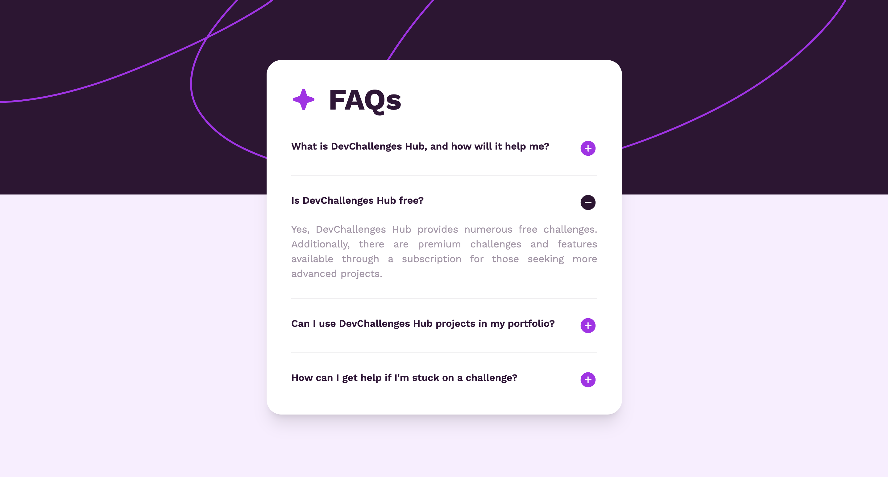

# React Accordi0n with Typescript and Tailwind

## Example solution for FAQ accordion challenge in frontend mentor.

- [link-to-the-challenge](https://www.frontendmentor.io/challenges/faq-accordion-wyfFdeBwBz)

### Description 📝



An accordion is a UI component that allows content to be expanded or collapsed with a click on the headers.

### Key Features of an Accordion:

1. **Expandable Sections**: Only one section is displayed at a time, while others remain hidden.
2. **Toggle Mechanism**: Users can click headers to expand or collapse content.
3. **Space Efficiency**: Saves screen space by collapsing unused sections.
4. **Interactive**: Enhances user experience by making navigation through content easier.

Accordions are widely used in FAQs, menus, and content-heavy websites to improve readability and organization.

In this app, the state keeps track of which section is expanded. The index of the expanded section is set as "active." When no sections are expanded, it's set to -1. All the functionality in this app is handled by this simple state.

```typescript
const [active, setActive] = useState<number>(-1);
```

For styling this app, Tailwind CSS is used. Since this is a very small and simple app, there's no issue using Tailwind here. But for much bigger projects, I'd rather use module-based CSS.

To ensure type security, I used TypeScript in this app. Of course, for this kind of app, it's not necessary to use TypeScript, but for self-practicing purposes, I used TypeScript here.

And that's pretty much it about this tiny project. This is the first of thousands of projects yet to be published 😅 Stay tuned!

## Try This App! 👼

### 1. Clone the Project

1. **Install Git**: Download from [git-scm.com](https://git-scm.com/).
2. **Open VS Code**.
3. **Clone Repository**:
   - Go to `View` -> `Command Palette` or press `Ctrl+Shift+P`.
   - Type `Git: Clone` and select `Git: Clone`.
   - Enter the repository URL (`https://github.com/Sachintha-Lakruwan/FAQ-accordion.git`) and click `Clone`.
   - Choose a local directory to save the repository.
   - Open the cloned repository when prompted.

### 2. Install npm Packages

1. **Install Node.js**: Download from [nodejs.org](https://nodejs.org/).
2. **Install npm Packages**:
   ```sh
   npm install
   ```

### 3. Run the Project

1. **Start the Development Server**:
   ```sh
   npm run dev
   ```
2. **Open in Browser**: Navigate to `http://localhost:5173/` (or specified port).
